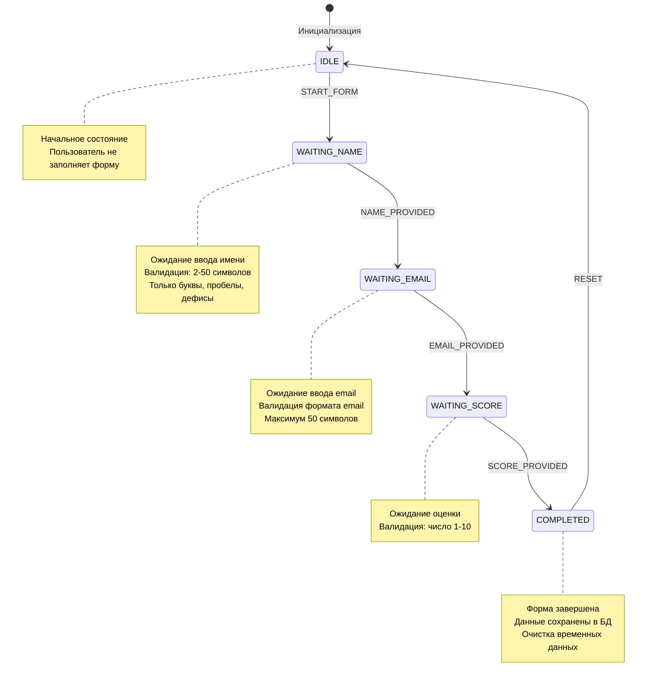

# Диаграмма Spring State Machine для формы

## Описание состояний

### IDLE
- Начальное состояние
- Пользователь не активен в форме
- Переход в WAITING_NAME по событию START_FORM (команда `/form`)

### WAITING_NAME
- Ожидание ввода имени пользователя
- Валидация:
  - Длина: 2-50 символов
  - Разрешены: буквы (русские и английские), пробелы, дефисы, апострофы
- При успешной валидации: переход в WAITING_EMAIL

### WAITING_EMAIL
- Ожидание ввода email
- Валидация:
  - Формат email (регулярное выражение)
  - Максимальная длина: 50 символов
- При успешной валидации: переход в WAITING_SCORE

### WAITING_SCORE
- Ожидание оценки от пользователя
- Валидация:
  - Целое число от 1 до 10
- При успешной валидации: переход в COMPLETED

### COMPLETED
- Конечное состояние формы
- Данные сохранены в основную БД (таблица user_responses)
- Автоматический переход в IDLE с очисткой данных

## События

- **START_FORM**: Начало заполнения формы
- **NAME_PROVIDED**: Имя успешно предоставлено и проверено
- **EMAIL_PROVIDED**: Email успешно предоставлен и проверен
- **SCORE_PROVIDED**: Оценка успешно предоставлена и проверена
- **RESET**: Сброс состояния после завершения

## Персистенция

Все состояния и временные данные формы сохраняются в БД:
- Таблица `user_states` - текущее состояние пользователя
- Таблица `user_state_data` - временные данные формы (имя, email)

При перезапуске бота состояния восстанавливаются из БД. 